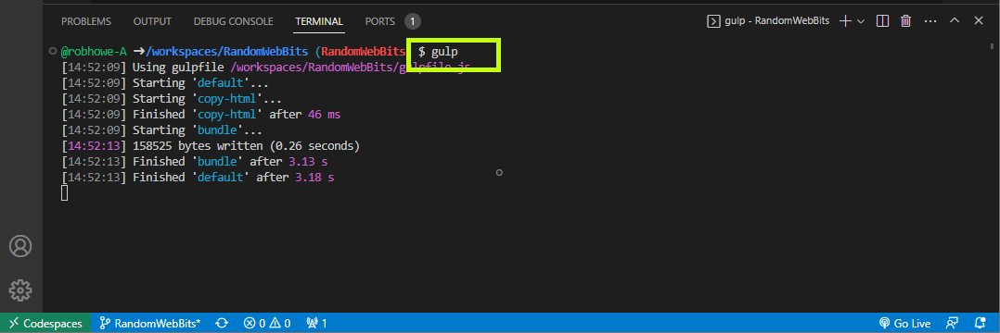
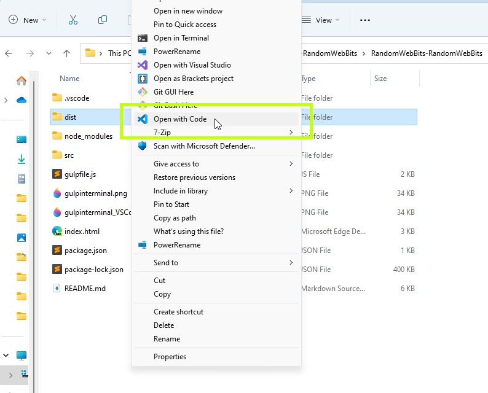
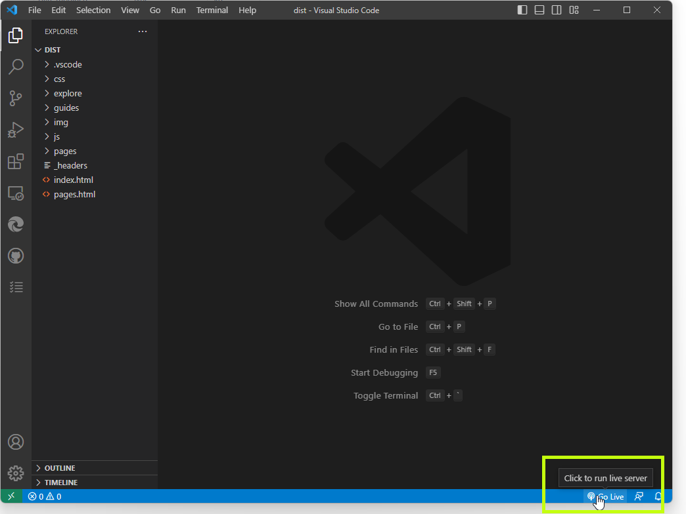
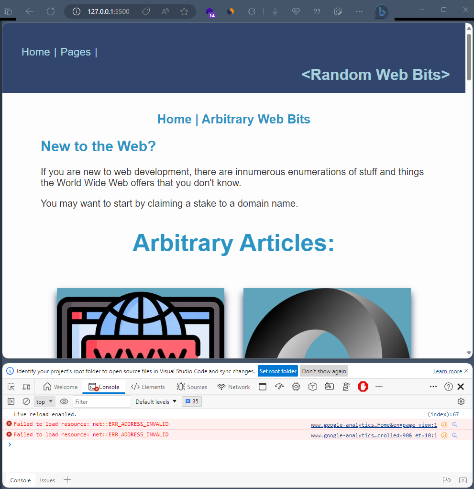

<!-- Copyright (c) 2023-2026 Robert A. Howell -->
# Random Web Bits

This repository holds frontend source code for the Random Web Bits website. Initially, the project was hosted on Netlify CDN and can still be accessed: [&lt;RWB&gt;](https://randwebbit.netlify.app/).  
[](https://randwebbit.netlify.app/)  

Today, the full website is not open-source and has moved to [https://randomwebbits.com/](https://randomwebbits.com/).  

Below, README markdown is a guide and additional information about this repository and may be followed to get the code and components into a development environment.  

<br>

**What is it?** A fun project to host short articles about the web and web development.  
**What does it do?** It's a website to showcase modern web development techniques. It is currently a static website, whereby all the code running the site is run in the browser. You can spin up a codespace or download the repro to run the code or test the development space.  

<br>

## Features

### Articles

- Fun bits of knowledge you may/may not know or have seen before.

### Responsive web design

- Developed for use on mobile/tablet/desktop devices
- CSS designs fit the wireframe structure and adapt to different viewport sizes

### JavaScript components

- A newer web development practice: JavaScript modules represent header, footer, and 'web bits' structures.
- The "home" and "pages" article cards are initialized as a "WebBits" component. They're rendered to the page using vanilla javascript, added directly to the DOM as whole fragments.
- PhotoSwipe library used in showcasing images in multiple locations
- Lit-Html library is utilized to create framework components, like those found in react and angular. Referring 'acronyms-element.js', HTML pages containing "acronyms-list" elements render the data imports.

```HTML
...
</head>
<body>
    <main>
    ...
    <acronyms-list></acronyms-list>
    </main>
<body>
</html>
```

-----

## &lt;RandomWebBits&gt;

<details>
<summary>Developers:</summary>

> Create a [codespace](https://docs.github.com/en/codespaces/developing-in-codespaces/creating-a-codespace-for-a-repository/#creating-a-codespace-for-a-repository) (from the green dropdown) to utilize GitHub's container-enabled development platform. Install **Live Server** VSCode extension, then 'Go Live' from there. Be sure to increase the CPU specs for faster load-times.
>
> - The website's code is in full in this repository.
> - Debug code in the browser. Any saved change is streamed to the browser from VSCode via Browserify.
> - Run the full developer's environment: 5 steps and the results:
>
> ```shell
> #1. Navigate to the project's folder and run the below (4) dependency installations
> # They install gulp-cli, gulp with typescript, browserify, tsify,
> # vinyl-source-stream, and watchify  dependencies needed to run
> # the developer's environment
> #
> #Node.JS commands to bring up the development
> npm install -g gulp-cli
>
> npm install --save-dev typescript gulp@4.0.0 gulp-typescript
>
> npm install --save-dev browserify tsify vinyl-source-stream
>
> npm install --save-dev watchify fancy-log
>
> [OPTIONAL] yarn add -D prettier@^2.5.1 eslint@^8.7.0 @typescript-eslint/parser@^5.0.1 typescript@^4.4.4
>
> #2. Once they're ready, run the below command to begin
> gulp
> ```
>
> 
> <br>
>
> ```shell
> #3 Extensions:
> -Live Server
> -Prettier - Code formatter
> -Python, Pylance
> -Tailwind Shades
>
> ```

</details>

<details>
<summary>Web Admins:</summary>

> The full site functions from the resources within "/dist" folder. All the other directory assets remain for development purposes, like utilizing TypeScript compiling (and intellisense).
>
> - Try exporting just the "/dist" folder, whereby the site is moved out of the developer's space. Running a web server of only the /dist folder resources produces the same site results without the developer's files. The site is then exportable to your web server of choice.  
>   1.) **Open** with VSCode  
>   2.) **Click "Go Live"** (From VSCode's live server extension)  
>   3.) Site is **live**. All pages, javascript, and styles are included in the distro  
>    > <br><br> >  > <br>

</details>



---

<em><u>Release Updates</u></em>

<details>
<summary>Version 1.0</summary>

1.0.0: Added Favicon to all pages. Edited Header/footer sections  
1.0.4:  
&nbsp;&nbsp;- Image optimizations and attributions.  
&nbsp;&nbsp;- Added footer UL of the requested attributions from FLATICON  
&nbsp;&nbsp;- New WebBits page: chatGPT  
1.0.6: Script.js changes  
&nbsp;&nbsp;- Added navigation link objects  
&nbsp;&nbsp;- GitHub Desktop - Squash commit history  
1.0.7: New WebBits page: paint3D  
1.0.8: Added dictionary page  
1.0.11:  
&nbsp;&nbsp;- Conformed dictionary.js to module, set to defer on load  
&nbsp;&nbsp;- Added dictionary.js to index.html  
&nbsp;&nbsp;- Changed index page WebBits to show 3 random articles  
1.0.12: New WebBits page: boinc  
1.0.15:  
&nbsp;&nbsp;- New WebBits page: ipaddress  
&nbsp;&nbsp;- Minor code fixes  
&nbsp;&nbsp;- Web Bits grammer fixes, edits, and corrections  
1.0.16: Minor code fixes  
1.0.19:  
&nbsp;&nbsp;- Dictionary search input validation  
&nbsp;&nbsp;- Added ToDo List page  
&nbsp;&nbsp;- Added ToDo List component on index  
1.0.20:: Refactor code: WebBits.js, script.js  
1.0.22:  
&nbsp;&nbsp;- New WebBits page: markup  
&nbsp;&nbsp;- New WebBits page: searchverticals  
1.0.23: New WebBits page: networkspeed  
1.0.24: Refactor To-Dos List  
1.0.25: New WebBits page: How E-mail Works

</details>

<details>
<summary>Version 1.1</summary>

1.1.26: Added guides card section  
1.1.28:  
&nbsp;&nbsp;- Lit component: Acronyms List  
&nbsp;&nbsp;- Components update, multiple pages  
1.1.29: New WebBits page: drives

</details>

<details>
<summary>Version 1.2</summary>

1.2.31:  
&nbsp;&nbsp;- Module design implementation  
&nbsp;&nbsp;- Component functionality updates  
1.2.32: New WebBits page: virtualtour  
1.2.33: New WebBits guide: applicationtab  
1.2.34: Added PhotoSwipe component to guide: applicationtab  
1.2.35: CSS color revision - dark mode/light mode  
1.2.36: PS updates networkspeed page  
1.2.37: Ammend widgets for Firefox functionality  
1.2.38: New WebBits page: dns  
1.2.39: New WebBits page: inspectpages  
1.2.40: Abbr additions, CSS adjustments, and general updates  
1.2.41: New WebBits page: google #1 website

</details>

<details>
<summary>Version 1.3</summary>

1.3.41: Added TypeScript project compiler  
1.3.43:  
&nbsp;&nbsp;- TypeScript variables changes  
&nbsp;&nbsp;- Header/Footer component addition  
1.3.45: Added DictionaryAPI 404 result  
1.3.46: Dictionary: Local Storage caches  
1.3.47: New WebBits page: DOM  
1.3.48: New WebBits page: webIDE  
1.3.49: New component: GrowingCard  
1.3.50: RWBcards class addition  
1.3.51: New WebBits: SVG  
1.3.52: New Page: flashcards.html  
1.3.53: New WebBits: javascript  
1.3.54: New WebBits: PWAIcon  
1.3.55: New WebBits page: LEARN: HTTP  
1.3.56: New WebBits page: CSS  
1.3.57: New WebBits page: GUIDE: Clearing cookies  
1.3.58: New WebBits page: EXPLORE: Webb Space Telescope  
1.3.59: New WebBits page: Latency

</details>

<details>
<summary>Version 1.4</summary>

1.4.59: Header/Footer refactor  
1.4.60: New WebBits page: HTML-ELEM

</details>

<details>
<summary>Version 1.5</summary>
 
1.5.60: Main switch

</details>

<details>
<summary>Version 1.6</summary>
 
1.6.60: Widescreens  
1.6.61: PageComponents refactor  
1.6.62: ClassComponents refactor  
1.6.63: Script performance  
1.6.64: New WebBits page: URL  
1.6.65: Heading Title IDs  
1.6.66: Added ColorCode class  
1.6.67: URL, HTML, CSS examples component refactor  
1.6.68: Added mobileMarkup component  
1.6.60: New WebBits page: Data Storage  
1.6.61: Font changes  
1.6.62: Static Object counters  
1.6.63: Domain lookup component  
1.6.63: sliderbar component  
1.6.64: ErrorBus component  
1.6.65: DictionarySearch Log  
1.6.66: ToDos Log  
1.6.67: Widgets Refactor  
1.6.68: Parser component  
1.6.69: Stringify component

</details>

<details>
<summary>Version 1.7</summary>
 
1.7.70: Footer addition  
1.7.71: New WebBits page: HSL  
1.7.72: New page: 404.html  
1.7.73: WebBits Slideshow component

</details>

<details>
<summary>Version 1.8</summary>

1.8.74: Lit Elements: TypeScript  
1.8.74: PhotoSwipe: TypeScript  
1.8.75: Logo attributions  
1.8.76: Animated Slideshow  
1.8.77: Added project ESLint  
1.8.78: Re-Added todos WebBit  
1.8.78: New WebBits page: ElementInspect  
1.8.79: WebBits Slideshow tabindex  
1.8.80: Header/Footer colors  
1.8.81: Propagation Latency Calculator  
1.8.82: RWB Card CSS  
1.8.83: RWB Card CSS flip direction  
1.8.84: New WebBits page: elementstab  
1.8.85: New WebBits page: consoletab  
1.8.86: New WebBits page: sourcestab  
1.8.87: New WebBits page: networktab  
1.8.88: New WebBits page: performancetab  
1.8.89: New WebBits page: memorytab  
1.8.90: New WebBits page: securitytab  
1.8.91: New WebBits page: lighthousetab  
1.8.92: New WebBits page: cssoverviewtab  
1.8.93: New WebBits page: Hyperlinks  
1.8.94: New WebBits page: Web API  
1.8.95: New WebBits page: Browser Cursors

</details>
